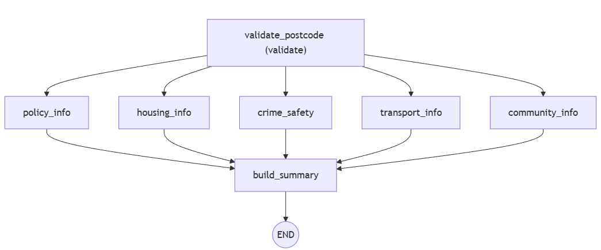

# CIVAI: AI-Powered Local Intelligence Platform

**One-line description:**  
CIVAI is a multi-agent AI platform that generates detailed, postcode-specific insights for London neighborhoods, covering housing, crime, transport, community, and local policies.

---

## Overview

CIVAI uses a multi-agent system powered by Google Gemini LLM and integrated tools to provide actionable insights for local areas. It fetches, analyzes, and summarizes data from multiple sources including public APIs, PDFs, and web search, producing structured and human-readable reports.  

The platform is built with **Python**, **LangGraph**, **MCP (Multi-Agent Control Protocol)**, **Google Gemini LLM**, and **ChromaDB** for vector embeddings and document retrieval.

---

## Agents

CIVAI consists of several specialized agents:

### Affordability Trend Visualization

Below is the affordability trend visualization for the year 2025:




### 1. **Postcode Validation Agent**
- Ensures the input postcode is valid and properly formatted according to UK standards.
- Standardises the postcode for downstream agents.

### 2. **Housing Agent**
- Fetches borough-specific housing data from Excel files.
- Queries mean household income via API.
- Calculates **affordability metric**: `house price / mean income`. This evaluates how easy it is to buy a home in the area.
- Uses local sales data to check how often houses are bought.
- Generates a natural-language summary of housing affordability and buying data using Gemini LLM.

### 3. **Crime & Safety Agent**
- Uses an API to fetch crome data for a postcode
- It clusters the crime categories 
- Uses the returned data to analyse the crime data
- Summarises key crime statistics and trends in plain English.

### 4. **Transport Agent**
- Uses **Google Search grounding** via MCP to retrieve public transport and commute information.
- Summarises nearby Tube/rail/bus stations, average commute times, cycling and walking options.

### 5. **Community Agent**
- Uses Google Search grounding to fetch information about:
  - Local parks and green spaces
  - Schools (with Ofsted ratings if available)
  - Religious sites (mosques, churches)
  - Shops, restaurants, cafes
  - Walkability and family-friendliness
- Produces a concise summary of community amenities and quality of life.

### 6. **Policy Agent**
- Retrieves council policies, zoning rules, planning regulations, and local guidance from PDFs or databases.
- Summarizes the key regulatory considerations for the area.

### 7. **Summary Agent**
- Collects outputs from all other agents.
- Produces a well-structured Markdown report combining housing, crime, transport, community, and policy insights.
- Suitable for reading in Markdown or converting to PDF.

---
## How to Run in Jupyter Notebook

1. Open `CIVAI.ipynb` in Jupyter.
2. Change the directory of the datasets in the code
3. Set the postcode:
```python
from state_model import State
state = State(postcode="W60WW")
```

---

## Key Technologies

- **Python 3.11** – Core programming language.
- **Google Gemini LLM** – For summarization, natural language generation, and reasoning.
- **MCP (Multi-Agent Control Protocol)** – Orchestrates agent communication and tool calls.
- **LangGraph** – Handles sequential and parallel agent execution and dependencies.
- **ChromaDB** – Stores embeddings for documents and PDFs for retrieval-based generation.
- **PDF Parsing** – Extracts policy and regulation documents for analysis.
- **APIs & Web Search** – Includes income APIs and Google Search for dynamic grounding.

---

## How It Works

1. The user inputs a **postcode**.
2. The **validation agent** checks and standardizes the input.
3. Parallel agents fetch and analyze:
   - Housing affordability
   - Crime & safety
   - Transport options
   - Community and amenities
   - Policy & regulations
4. Each agent generates summaries using **Gemini LLM**.
5. The **summary agent** compiles everything into a clean report.

---

## Example Report

```markdown
## 🏙️ CIVAI Intelligence Report
### Postcode: W60WW

### 🏠 Housing Overview
Housing is moderately expensive with an average house price of £550,000 and mean household income of £65,000. Affordability ratio is 8.5, indicating above-average cost of living.

### 🔒 Crime & Safety
Crime is relatively low with minor incidents reported. Safe neighborhoods and community policing are in place.

### 🚆 Transport & Connectivity
Nearby Tube stations: Hammersmith, Barons Court. Average commute to Central London is 25 minutes. Good walkability and cycling options.

### 🏘️ Community & Local Amenities
Local parks: Ravenscourt Park, Brook Green. Schools with good Ofsted ratings. Several mosques and churches. Shops, supermarkets, cafes, and restaurants are accessible. Safe and family-friendly.

### 📜 Local Policies & Regulations
Council planning regulations focus on affordable housing initiatives and green space preservation.
```

## Notes for the project
Due to time contraints, it was not possible to cover all of London's boroughs. The API that gets the crime and housing data is a paid one and only allows 2 postcodes to be entered for free. If there was more time, I would find another API that will cover a larger range of areas. 
